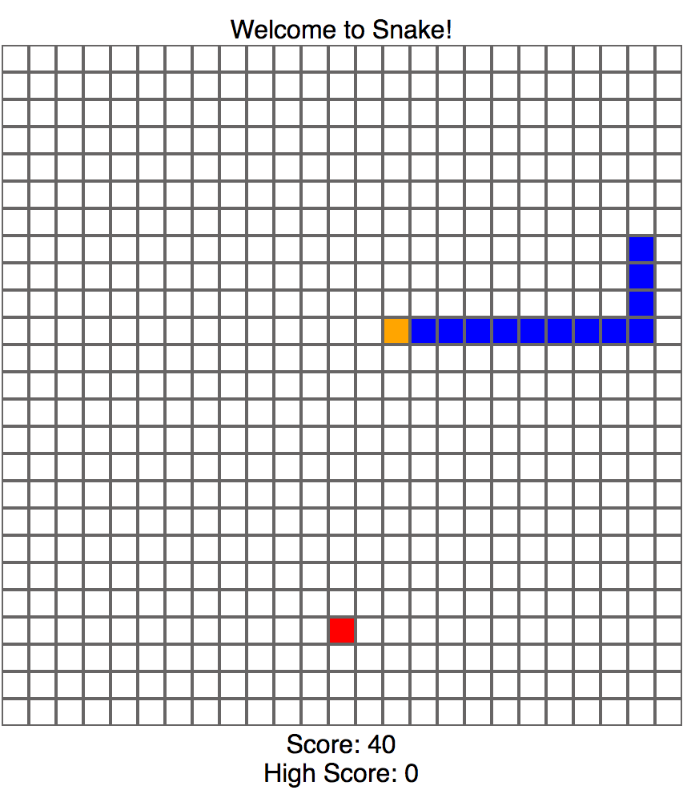

# pDOM

[Snake Demo][link]
[link]: http://www.philippark.us/pDOM



## Background

pDOM is a lightweight Javascript library inspired by jQuery. It simplifies HTML document tranversing, event handling, and AJAX requests in Javascript.

## Guidelines

## Installation

To use pDOM, start by downloading pDOM and include it in your project directory.  
Then, include the following script tag in the 'head' section of your HTML document:

``` javascript
  <script type="text/javascript" src="lib/pdom.js"></script>
```

## Examples

With pDOM, you can perform some basic DOM manipulation functions:

You can select specific HTML elements or selectors:

``` javascript
$p('li')
// select all li elements

$p('.header')
// select elements with 'header class
```

You can also change the innerHTML of the selected elements:

``` javascript
$p('li').html('yippee')
// select li elements and change innerHTML to 'yippee'
```

You can implement event handlers...

``` javascript
$p('.button').on('click', () => {
  console.log('Clicking button class now');
})
// clicking anything with the button class will log the above message
```

You can also perform an AJAX request...

``` javascript
// fetches weather information
$p.ajax({
  method: "GET",
  url: "http://api.openweathermap.org/data/2.5/weather?q=London,uk&appid=bcb83c4b54aee8418983c2aff3073b3b",
  success(data) {
    console.log("Here is the weather")
    console.log(data);
  },
  error() {
    console.error("An error has occured with your request.");
  }
})
```

### `DOMNodeCollection.prototype` Methods

#### `html`
* Takes a string as an optional argument
* If no argument is given, it returns the `innerHTML` of the first node of the collection
* if a string is given as an argument, the string is set as the `innerHTML` of each node in the collection

#### `empty`
* Removes all child nodes in the node collection

#### `append`
* Takes a string, HTML element, or pDOM wrapped node collection
* Appends the `outerHTML` of the given argument to the `innerHTML` of each element in the node collection

#### `attr`
* Takes an attribute parameter with an optional value parameter (attribute, value)
* Given just an attribute parameter, returns the first element in the node collection that matches the attribute
* Given both attribute and value paramters, sets the matched attribute to the value paramter for each node in the collection

#### `addClass`
* Takes multiple classes as arguments and adds each to the list of classes of each node in the node collection

#### `removeClass`
* Takes multiple classes as arguments and removes each from the class list of each node in the node collection

#### `children`
* Returns collection of all children of each node

#### `parent`
* Returns collection of all parent nodes

#### `find`
* Takes a selector as an argument and returns all descendants of each node in the set of matched nodes.

#### `remove`
* Removes all instances of each node from the DOM

#### `on`
* Takes as arguments an event and callback and adds an eventListener for each element in the collection
* Activates callback action when triggered  

#### `off`
* Takes an event as an argument and removes all eventListeners for each element in the collection
